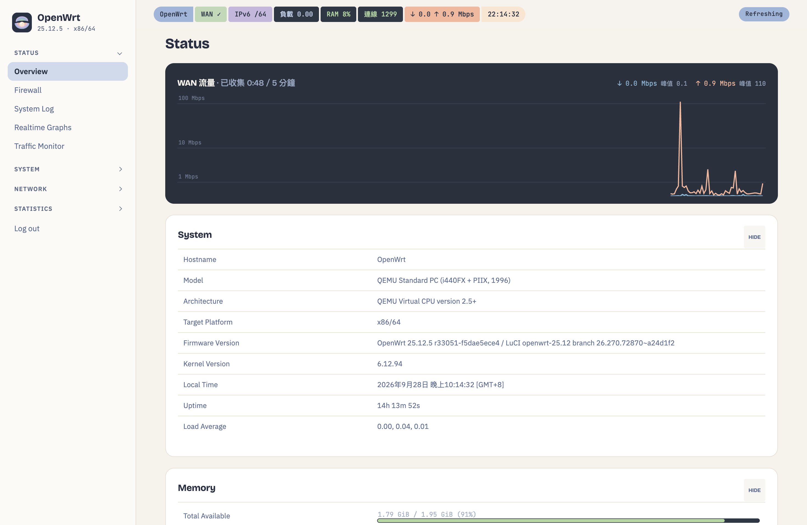
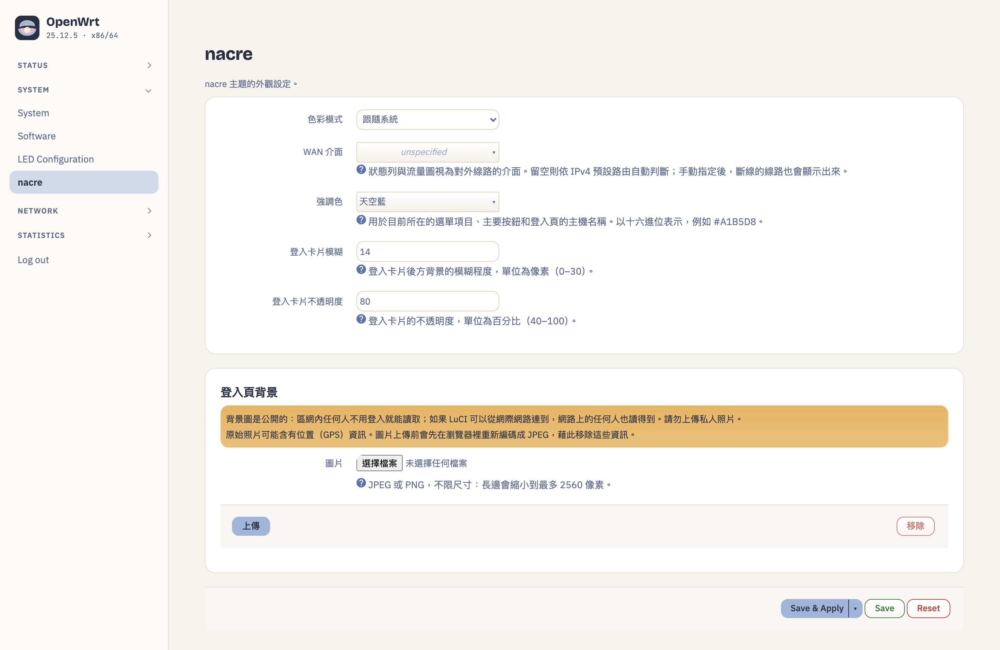
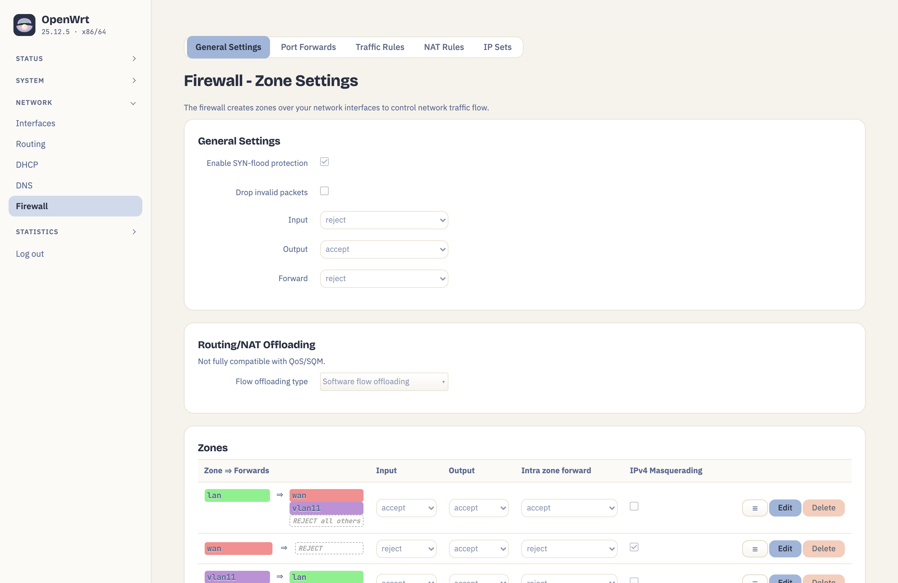

# nacre

> 一套柔和、有層次的 OpenWrt 25.12 LuCI 主題：採用 coralline 的 morning-haze 配色，側邊欄不搶戲，登入頁可以換成你自己的照片。

[English](./README.md)

<picture>
  <source media="(prefers-color-scheme: dark)" srcset="assets/screenshots/overview-dark.png">
  
</picture>

## 你會得到什麼

| | |
|---|---|
| **配色** | coralline 的 *morning-haze*：長春花藍、薰衣草、鼠尾草、沙金、赤陶色的粉彩，搭配墨色文字，數據用深板岩色。支援淺色、深色、跟隨系統。 |
| **版面** | 左側側邊欄，群組可以收合；在手機上會變成抽屜。分頁標籤是 pill 分段選單。 |
| **狀態列** | 總覽頁頂端有一條 coralline 風格的 pill 狀態列，依序顯示：主機、WAN、IPv6 前綴、負載、記憶體、連線數、WAN 即時流量、時鐘。只用 LuCI 原本的狀態頁就讀得到的資料，**不需要額外權限**。 |
| **登入頁** | 預設是層狀波紋背景，也可以換成你的照片。模糊、玻璃透明度和主色都可以調整。 |
| **字型** | 內建 Bricolage Grotesque、IBM Plex Sans、JetBrains Mono（OFL 授權），路由器不用連網也能正常顯示。中文使用系統字型。 |

nacre 建立在上游 bootstrap 主題的變數系統之上，所以 LuCI 的每一頁和每個外掛都會套到樣式。nacre 只在上面加了配色、字型和版面。

| | |
|---|---|
|  |  |
|  |  |

## 需求

- OpenWrt **25.12**（apk）。不支援 OpenWrt 24.10 以前的版本（opkg）。
- 任何架構皆可，套件是 `noarch`。

## 安裝

在路由器上以 root 執行：

```sh
sh -c "$(curl -fsSL https://raw.githubusercontent.com/Nanako0129/nacre/main/install.sh)"
```

腳本會加入 nacre 的簽章套件源：把公鑰放到 `/etc/apk/keys/nacre.pem`，把套件源加進 `customfeeds.list`。接著用套件名稱安裝 `luci-theme-nacre` 和 `luci-app-nacre-config`，切換成 nacre 前會先問你。加上 `-y` 就會直接切換：

```sh
sh -c "$(curl -fsSL https://raw.githubusercontent.com/Nanako0129/nacre/main/install.sh)" -- -y
```

安裝本身不會自動切換主題。之後也可以到「系統 → 系統 → 語言與樣式」選擇 **nacre**。

### 從 LuCI 的「軟體套件」頁安裝

只要公鑰放上路由器，剩下的步驟都可以在網頁上點選完成。放公鑰是 LuCI 唯一做不到的一步，因為「設定 apk」只能編輯套件源清單，不能新增金鑰：

```sh
wget -O /tmp/nacre.pem https://nanako0129.github.io/nacre/nacre.pem
grep -q 'BEGIN PUBLIC KEY' /tmp/nacre.pem && mv /tmp/nacre.pem /etc/apk/keys/nacre.pem
```

接著到 LuCI 的「系統 → 軟體套件 → 設定 apk」，在 `customfeeds.list` 加上這一行：

```
https://nanako0129.github.io/nacre/25.12/packages.adb
```

按「更新清單…」，搜尋 `nacre`，安裝 `luci-theme-nacre`。之後有新版本時，會出現在「更新」分頁。

### 信任

套件源的索引是用 nacre 自己的金鑰簽章的，金鑰的 sha256 指紋如下：

```
44fca33ef041692aa55bc2acbdae1c32c2889c75800d87bae7668f3d63c5f2db  nacre.pem
```

可以用 `sha256sum /etc/apk/keys/nacre.pem` 核對。apk 會對 `/etc/apk/keys` 裡的每一把金鑰、在每一個套件源上都給予信任，所以這把金鑰能簽的不只是 nacre 的套件，而是任何套件名稱。這和你信任 nacre 自己的更新是同一個層級，因為那些更新本來就以 root 身分執行。

如果你手動移除 nacre，也請刪掉 `/etc/apk/keys/nacre.pem` 和那一行套件源；`install.sh uninstall` 會自動處理這兩項。重新執行 `install.sh` 會覆寫金鑰，金鑰輪替後，新金鑰就是這樣換到你的路由器上的。

GitHub Release 附件裡的是同一批套件，但單獨下載的 `.apk` 本身沒有簽章，用「上傳套件…」安裝會出現 `UNTRUSTED signature`。請使用套件源安裝。

## 設定

「系統 → nacre」可以設定色彩模式、主色、登入卡片的模糊與透明度，以及登入背景。

登入背景放在 `/www` 底下，所以**區網內任何人不用登入就看得到**，登入頁才能顯示它。照片上傳前會先在你的瀏覽器裡重新編碼成 JPEG，順便去掉位置等中繼資料。即便如此，還是不要用你不想讓訪客看到的照片。

## 移除

```sh
sh -c "$(curl -fsSL https://raw.githubusercontent.com/Nanako0129/nacre/main/install.sh)" -- uninstall
```

會把 LuCI 切回 bootstrap，並移除套件、已上傳的背景、設定，以及 nacre 的金鑰和那一行套件源。

## 名字的由來

**Nacre** 是珍珠層，也就是珍珠母，語源是阿拉伯文的 *naqqāra*，意思是「貝殼」。珠母貝不會把跑進殼裡的沙粒排掉，而是一層又一層地包上薄薄的光澤，直到粗糙的東西變成平滑、帶虹彩的東西。nacre 對 LuCI 做的是同一件事：路由器的每一頁都還在底下，只是被包進了柔和的層次裡。圖示就是那顆牡蠣，殼上的色帶就是那一層層的珍珠層。

它是 [coralline](https://github.com/Nanako0129/coralline) 的姊妹作。coralline 也是一種海洋生物分泌出來的礦物，而且 nacre 的配色就來自它。

## 建置

用 OpenWrt 25.12 SDK 建置（`luci.mk` 格式，`include $(TOPDIR)/feeds/luci/luci.mk`）。`tools/build.sh` 會透過 SSH 在原生 x86_64 的 SDK 上建置，需要的變數請見腳本內容。

## 授權

Apache-2.0，與 LuCI 相同。衍生自 `luci-theme-bootstrap`（© The LuCI Team）。內建字型採用 SIL Open Font License，授權檔放在 `luci-static/nacre/fonts/` 裡。
